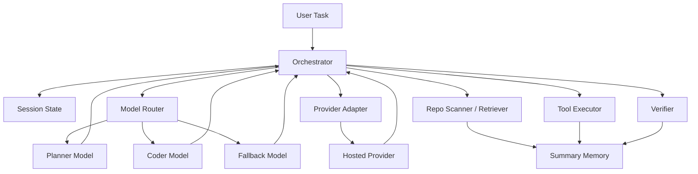

# Architecture

## Intent

Micro Claw should be built as a coding system, not a chat wrapper. The architecture should separate orchestration, tool execution, memory, and model routing so the system can keep improving whether the active model is local or remote.

## High-Level Shape

## Core Components

### 1. Orchestrator

The orchestrator owns the agent loop. It should:

- receive the user task,
- ask for a short repo scan,
- select the model profile,
- request a structured plan,
- choose the next action,
- call tools,
- decide whether to continue, retry, or stop.

The orchestrator should stay deterministic where possible. It should not let the model freely invent new tools or hidden state.

### 2. Model Router

The router decides which local profile to use for the current step.

Typical routing:

- small planner for quick classification and task shaping,
- stronger coder for patch generation,
- lightweight fallback for summaries, retries, or low-memory mode,
- same-model mode when only one model can stay loaded.

The router should consider:

- available memory,
- current model warm state,
- task type,
- repository size,
- verification pressure,
- latency budget.

If remote API mode is active, the router should select a hosted provider path instead of a local model path and should avoid waking any local inference runtime unless the policy explicitly allows fallback.

### 3. Provider Adapter

The provider adapter is the thin layer between the orchestrator and hosted APIs.

Responsibilities:

- read provider selection and API keys,
- send streamed requests,
- enforce request budgets,
- normalize responses into the same structured contract used by local models,
- keep local memory usage low by avoiding oversized in-process caches.

This component is what makes minimum-RAM API mode realistic instead of accidental.

### 4. Repo Scanner And Retriever

This layer gathers only the context the current step needs.

Responsibilities:

- list files,
- detect tech stack,
- summarize large files,
- maintain compact notes about modules and commands,
- retrieve the smallest useful context slice for the active step.

This is critical because smaller local models improve sharply when they are given cleaner context.

### 5. Summary Memory

Memory should be compact, explicit, and disposable.

Store:

- repo summaries,
- prior plan decisions,
- files touched,
- test commands discovered,
- failure summaries,
- known constraints.

Do not store:

- full terminal dumps forever,
- giant prompt transcripts,
- speculative reasoning that no longer matters.

### 6. Tool Executor

The tool layer should be intentionally small at first:

- file read,
- file write or patch,
- shell command,
- test command,
- git status or diff,
- search,
- optional structured web access later.

Every tool invocation should return structured results so the model can reason over facts instead of prose noise.

### 7. Verifier

The verifier is separate from the coder role.

It should:

- run project checks,
- detect whether files changed as expected,
- classify failures,
- decide whether the patch is likely correct,
- trigger one more repair cycle when evidence says the task is close.

### 8. Safety And Limits

Guardrails should be architecture, not only prompt text.

Required controls:

- explicit allowlist for tools,
- max command duration,
- max patch size per step,
- confirmation policy for destructive commands,
- stop-after-N retries for the same failure type,
- clear logging of actions taken.

## Operating Modes

### Single-Model Mode

Best for tight memory environments. One model handles planning and coding, with stronger reliance on structured prompts and aggressive context pruning.

### Dual-Role Logical Mode

Preferred design. Planner and coder are separate roles, but not necessarily separate resident models. The router may swap them in and out one at a time.

### Thin Remote Mode

Best for the lowest local RAM usage. The local process acts as an orchestrator and tool runner while inference happens through a hosted API. This mode should avoid starting Ollama, avoid in-memory retrieval services by default, and persist summaries to disk instead of holding large live state.

### Verification-Heavy Mode

Use for code changes on unfamiliar repos. Spend more budget on test execution and failure analysis than on huge prompts.

## Data Contracts

The LLM-facing contracts should be structured. At minimum:

- `task_summary`
- `assumptions`
- `needed_context`
- `next_action`
- `expected_result`
- `verification_plan`
- `done_or_retry`

Structured outputs matter because they reduce parsing mistakes and make smaller models more reliable.

## Recommended Build Order

1. Repo scanner and shell tool layer.
2. Structured planner output.
3. Patch-writing coder path.
4. Verification runner.
5. Summary memory.
6. Model routing and profile switching.
7. Benchmark harness.

That sequence delivers usable value before the full system is complete.
